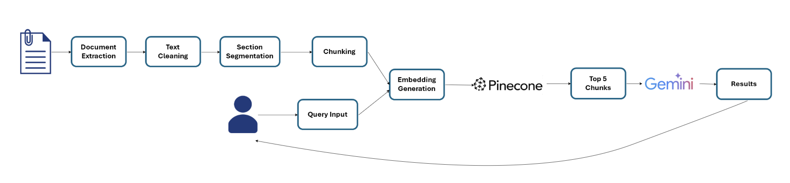

# 📚 Research Paper Q&A Assistant

A semantic search and question-answering system for research papers using **Retrieval-Augmented Generation (RAG)** and **Large Language Models (LLMs)**.

## 🚀 Overview

This system enables users to:

- Upload research papers (PDF)
- Ask natural language questions
- Receive concise, context-grounded answers with traceable sources

### 🔧 Built With:

- [LangChain](https://github.com/langchain-ai/langchain)
- [Hugging Face Transformers](https://huggingface.co/sentence-transformers/all-MiniLM-L6-v2)
- [Pinecone](https://www.pinecone.io/)
- [Google Gemini 1.5 Pro](https://deepmind.google/technologies/gemini/)
- [Flask](https://flask.palletsprojects.com/)

---

## 🧠 Features

- 📄 PDF parsing with text cleaning
- 🔍 Section segmentation & semantic chunking
- 🧬 Embedding generation with `all-MiniLM-L6-v2`
- 📦 Vector indexing with Pinecone
- 🤖 Contextual answer generation using Gemini 1.5 Pro
- 🌐 Web UI for upload and Q&A
- ✅ Transparent answers with source document snippets

---

## 📋 Methodology

The system follows a **Retrieval-Augmented Generation (RAG)** pipeline with two main phases: **Uploading** and **Querying**.



### Uploading Phase

1. **Document Extraction** — PDFs are parsed with PyPDFLoader; text and metadata (title, page count) are extracted from each page.
2. **Text Cleaning** — Raw text is preprocessed: special characters, headers, footers, page numbers, and stop words are removed via regex and NLTK.
3. **Section Segmentation** — Cleaned text is split into logical sections (Abstract, Introduction, Methodology, Results, Conclusion, References) by detecting section headers with regex.
4. **Chunking** — Each section is split into overlapping chunks (1000 characters, 40-character overlap) using `RecursiveCharacterTextSplitter` to preserve context across boundaries.
5. **Embedding Generation** — Each chunk is converted to a 384-dimensional vector using `all-MiniLM-L6-v2`.
6. **Indexing** — Embeddings and metadata (section, title, source) are stored in a Pinecone vector index for similarity search.

### Querying Phase

1. **Query Input** — The user submits a natural language question via the web UI.
2. **Query Embedding** — The query is embedded with the same model as document chunks so both live in the same semantic space.
3. **Similarity Search** — Cosine similarity in Pinecone retrieves the **top 5** most relevant chunks.
4. **Contextual Answer Generation** — Retrieved chunks are passed to Gemini 1.5 Pro as context; the LLM synthesizes a concise answer using only this context.
5. **Response Delivery** — The answer and supporting chunks are returned so users can trace and verify sources.

---

## ⚙️ Implementation

### Architecture

| Component | Technology |
|-----------|------------|
| **Vector DB** | Pinecone (serverless, AWS, cosine similarity) |
| **Embeddings** | `sentence-transformers/all-MiniLM-L6-v2` (384-dim) |
| **LLM** | Google Gemini 1.5 Pro (temperature=0.3 for factual answers) |
| **Framework** | LangChain (document loading, splitting, chains) |
| **Web Server** | Flask |

### Core Modules

- **`upload_file.py`** — Loads PDFs, cleans text, segments by section, chunks, generates embeddings, and indexes into Pinecone.
- **`query_engine.py`** — Embeds the query, retrieves top‑5 chunks from Pinecone, and runs the RAG chain with Gemini.
- **`server.py`** — Flask app exposing `/upload` and `/query` endpoints and serving the web UI.

### RAG Pipeline

The retriever uses `search_type="similarity"` with `k=5`. Retrieved chunks are fed to a prompt instructing the LLM to use only the provided context, answer in up to three sentences, and say when the answer is unknown. Both the generated answer and source chunks are returned for transparency.

---

## Method 1: Using the Setup Script

```bash
chmod +x run_app.sh
./run_app.sh
```

## Method 2: Manual Execution

### 🛠️ Installation & Setup

1. **Clone the repository**

```bash
git clone https://github.com/ajay-del-bot/research_paper_RAG_chain.git
cd research_paper_RAG_chain
```

2. **Create and activate a virtual environment**

```bash
# For Linux/macOS
python3 -m venv venv
source venv/bin/activate

# For Windows
python -m venv venv
venv\Scripts\activate
```

3. **Install dependencies**

```bash
pip install -r requirements.txt
```

4. **Set up environment variables in `.env`**

```env
PINECONE_API_KEY=YOUR_PINNECONE_API_KEY
GOOGLE_API_KEY=YOUR_GOOGLE_API_KEY
INDEX_NAME='test-db'
```

### 💻 Running the App

```
python3 src/server.py
```

## 🧪 Future Enhancements

- Support for tables, figures, equations
- Better layout handling for multi-column PDFs
- User authentication & session history
- Integration with multiple LLMs
